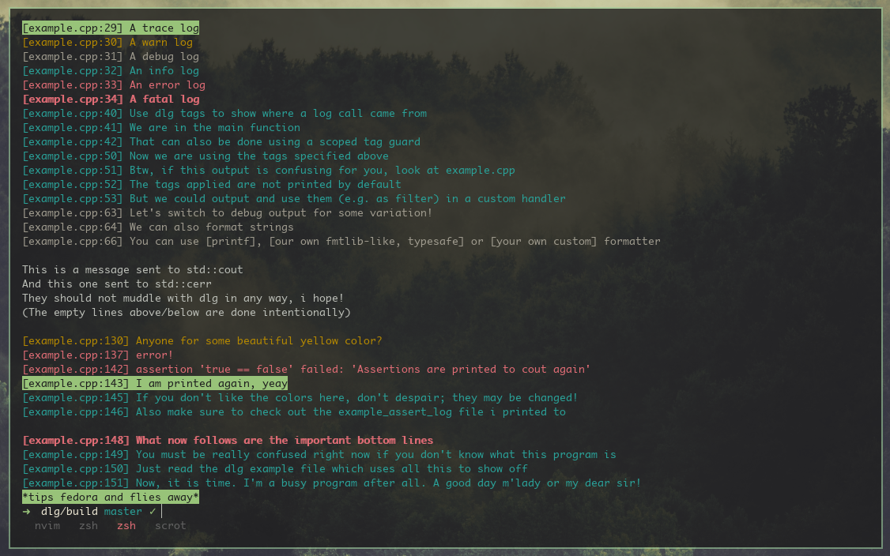

[](https://ci.appveyor.com/project/nyorain/dlg/branch/master)
[](https://travis-ci.org/nyorain/dlg)

dlg
===

Just another lightweight logging library with C and C++ api.
Pretty much everything can be configured (kinda like bring your own outputting
and formatting and filtering system and handle all the additional
fancy stuff yourself, but only if you want to, otherwise we got some
pretty nice defaults for you).

I tried hard to keep the amount of unneeded bullshit to a minimum (*adding loc
amount to convince you here, pretty hard to write much bullshit besides a
well-documented logging interface in a few hundred lines*):

There are 3 headers:

- [<dlg/dlg.h>](include/dlg/dlg.h) (around 230 loc): Everything you need, no dependencies
- [<dlg/output.h>](include/dlg/output.h) (around 150 loc): Utilities for implementing custom output handlers
- [<dlg/dlg.hpp>](include/dlg/dlg.hpp) (around 330 loc): Modern C++11 utilities, typesafe formatter

You can either build dlg.c as library or include it directly into your project
(nothing else needed).
The name stands for some kind of super clever word mixture of the words 'debug'
and 'log' (think of something yourself, duh). Uses meson as build system, but
you don't really need a build system for this after all.

## Show me something fancy already

Besides a simple look into the [headers](include/dlg), have a look into the
__[synopsis](docs/api.md)__ and additional documentation for the latest release.

Thousands words, explanations and pictures don't say as much as a single __[code example](docs/examples/example.cpp)__ though.
Here a simple preview of its core functionality (there is more fancy stuff, look into the linked example):

```c
dlg_warn("This is a warning. If on a console, it will be printed yellow");
dlg_error("Errors are red. Colors work even on windows consoles");
dlg_assertm(1 == 2, "Well, this assertion will probably %s...", "fail");
dlg_infot(("tag1", "tag2"), "We can tag our stuff. Can be used to filter/redirect messages");
dlg_asserttm(("tag3"), 3 == 2, "The same goes for asserts");
dlg_info("Another feature: Utf-8 printing works automatically, even for שׁǐʼnďốẅś consoles");
dlg_fatal("This one is printed bold. For more information, read the linked example above already");
```

Nontheless a rather beautiful picture of dlg in action for you. It is probably rather nonsensical without
having read the example though:



Note though that dlg can be used without weird dummy messages as well.
Building the sample can be enabled by passing the 'sample' argument as true to meson (meson <build dir> -Dsample=true).

__Contributions of all kind are welcome, this is nothing too serious though__
